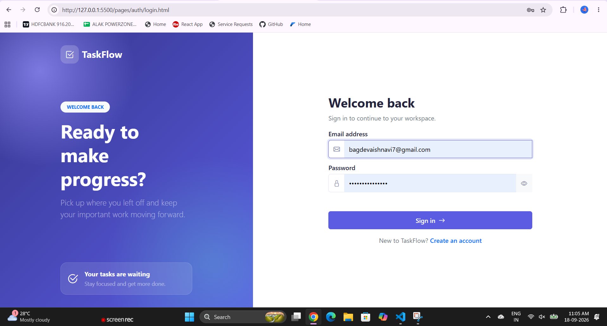
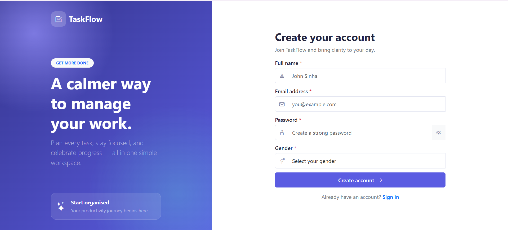
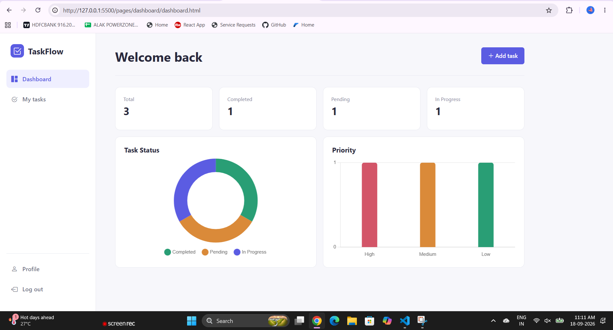
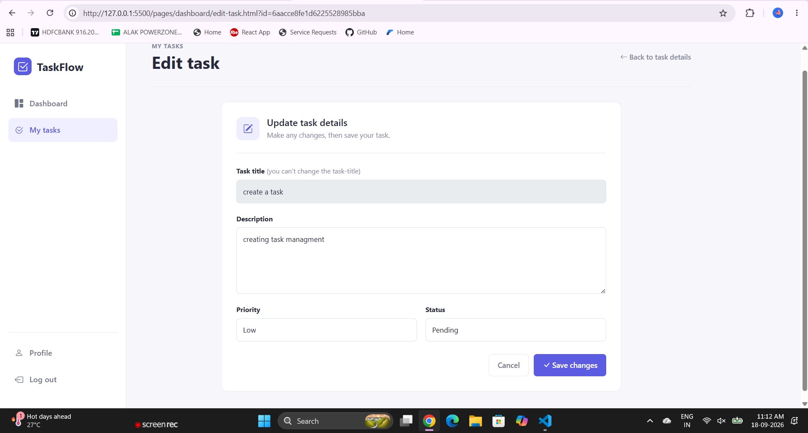
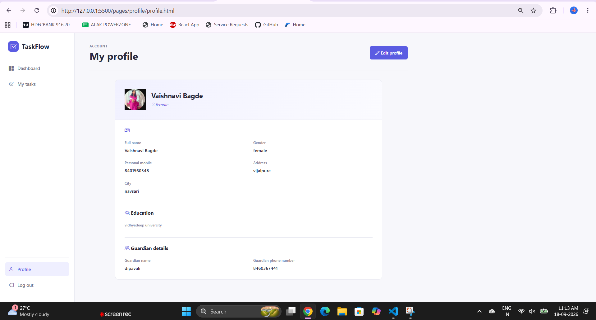
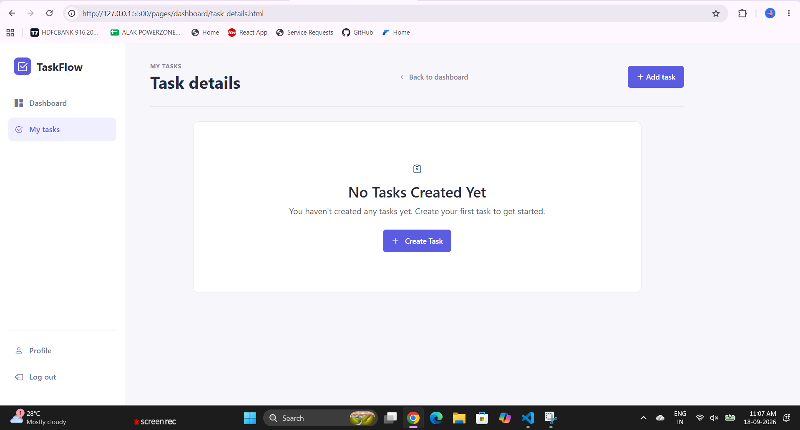

# TaskFlow — Task Management System

A clean, responsive **Task Management Web Application** built with **HTML5, CSS3, Vanilla JavaScript, Bootstrap 5, and REST APIs**.

TaskFlow helps authenticated users create, manage, update, track, and delete tasks through a simple productivity-focused dashboard.

---

## 📸 Screenshots

### 🔐 Login



### 📝 Create Account



### 📊 Dashboard



### ✏️ Edit Task



### 👤 Profile



### 📋 Task Details



---

## 🎥 Demo Video

Watch the complete working demonstration of TaskFlow:

[▶️ Watch TaskFlow Demo Video](imgs/task-management-live-demo.mp4);


---

## 📌 Overview

TaskFlow is a frontend-only task management application that communicates with a remote REST API.

The project demonstrates practical frontend development concepts including:

- User registration and login
- JWT/Bearer-token authentication
- CRUD operations
- REST API integration using `fetch()`
- Task status management
- Task priority management
- Dashboard statistics
- Chart-based data visualization
- User profile management
- Profile image validation
- Client-side form validation
- Loading states
- SweetAlert2 notifications
- Responsive UI
- Error-page handling
- Browser `localStorage` session management

---

## ✨ Features

### 🔐 Authentication

- User signup
- User login
- JWT/access-token storage
- Protected API requests
- Login-required redirects
- Logout functionality
- Session token removal

### 📝 Task Management

- Create a task
- View authenticated user's tasks
- View task details
- Edit task description
- Edit task priority
- Change task status
- Delete tasks
- Delete confirmation dialog
- Task ID validation
- Empty-task handling

### 📊 Dashboard

The dashboard provides a quick overview of the user's tasks:

- Total tasks
- Completed tasks
- Pending tasks
- In-progress tasks
- Task status doughnut chart
- Task priority bar chart

### 👤 Profile Management

- View user profile
- Edit profile information
- Update profile fields
- Upload profile image
- Validate image format
- Validate maximum image size

Supported profile images:

- JPG
- JPEG
- PNG

Maximum file size: **2 MB**

### ⚠️ Error Handling

Dedicated error pages are included for:

- `404` — Page Not Found
- `500` — Server/API/Unexpected Error

The application also uses `try/catch` around asynchronous API operations and provides user-friendly error feedback.

---

## 🛠️ Tech Stack

| Technology | Purpose |
|---|---|
| HTML5 | Page structure |
| CSS3 | Custom styling |
| JavaScript ES6+ | Application logic |
| Bootstrap 5.3.8 | Responsive UI |
| Bootstrap Icons 1.11.3 | Icons |
| SweetAlert2 11.26.25 | Alerts and confirmations |
| Chart.js 4.4.4 | Dashboard charts |
| REST API | Backend communication |
| Fetch API | HTTP requests |
| localStorage | Access-token/session storage |

> **Note:** This project intentionally uses **Vanilla JavaScript** and does not require React, Vue, Angular, or another frontend framework.

---

## 🏗️ Project Architecture

```text
Task_Management_system_javascript/
│
├── css/
│   ├── 404.css
│   ├── dashboard.css
│   ├── loader.css
│   ├── login.css
│   └── signup.css
│
├── js/
│   ├── auth.js
│   ├── dashboard.js
│   ├── tasks.js
│   ├── profile.js
│   └── loader.js
│
├── pages/
│   ├── 404/
│   ├── auth/
│   ├── dashboard/
│   ├── tasks/
│   └── profile/
│
├── imgs/
│   ├── create_account.png
│   ├── dashboard.png
│   ├── edittask.png
│   ├── login.png
│   ├── profile.png
│   ├── successlogin.png
│   ├── success_creating_account.png
│   ├── task-details-1.png
│   └── demo.mp4
│
├── index.html
└── README.md
```

---

## 🔗 API

TaskFlow communicates with the following REST API:

```text
https://intern-crud-task-api.onrender.com
```

### Authentication

The application sends the access token using the Bearer authentication scheme:

```text
Authorization: Bearer <accessToken>
```

### Main API Routes

```text
POST   /api/auth/signup
POST   /api/auth/login

GET    /api/tasks
POST   /api/tasks
PUT    /api/tasks/:id
DELETE /api/tasks/:id
```

> API availability depends on the remote backend service.

---

## 🔑 Authentication Flow

```text
User
 │
 ├── Signup
 │      ↓
 │   Account Created
 │
 ├── Login
 │      ↓
 │   JWT Access Token
 │      ↓
 │   localStorage
 │      ↓
 └── Protected Pages
        ↓
     API Requests
        ↓
   Authorization Header
```

---

## 📋 Task Flow

```text
Login
  ↓
Dashboard
  ↓
Create Task
  ↓
View Tasks
  ↓
View Task Details
  ↓
Edit Task
  ↓
Change Status / Priority
  ↓
Delete Task
```

---

## 💾 Session Management

TaskFlow uses browser `localStorage` to store the authentication token.

Storage key:

```text
accessToken
```

When the user logs out, the stored authentication token is removed and the user is redirected to the login page.

---

## 🚀 Getting Started

### 1. Clone the repository

```bash
git clone YOUR_GITHUB_REPOSITORY_URL
```

### 2. Open the project

Open the project folder in **VS Code**.

### 3. Run with Live Server

Because the project uses frontend files and JavaScript modules, it is recommended to run it through a local development server.

Example:

```text
http://127.0.0.1:5500/
```

### 4. Login or create an account

Open the application and create a new account or log in with an existing account.

---

## 🧪 Validation & Error Handling

The application includes validation for:

- Required form fields
- Task ID
- Profile image type
- Profile image size
- Authentication token
- API response errors
- Empty task lists
- Invalid routes
- Failed asynchronous requests

User-friendly notifications are displayed using **SweetAlert2**.

---

## 📱 Responsive Design

TaskFlow is designed to work across:

- Desktop
- Laptop
- Tablet
- Mobile devices

The UI uses **Bootstrap 5.3.8** and custom CSS for responsive layouts.

---

## 🎯 Project Goals

This project was created to demonstrate practical frontend development skills, including:

- JavaScript DOM manipulation
- Asynchronous programming
- REST API integration
- Authentication handling
- CRUD operations
- Form validation
- Error handling
- Responsive UI development
- Dashboard data visualization
- Client-side session management

---

## 🔮 Future Improvements

Possible future enhancements include:

- Search and advanced task filtering
- Task sorting
- Pagination
- Dark mode
- Better accessibility support
- Refresh-token authentication
- Real-time task updates
- Unit and integration testing
- Automated CI/CD deployment
- Improved API error handling

---

## 👩‍💻 Author

**Vaishnavi Bagde**

Full Stack / MERN Stack Developer

---

## 📄 License

This project is created for **learning, development, and portfolio purposes**.

---

⭐ If you find this project useful, consider giving the repository a star!
