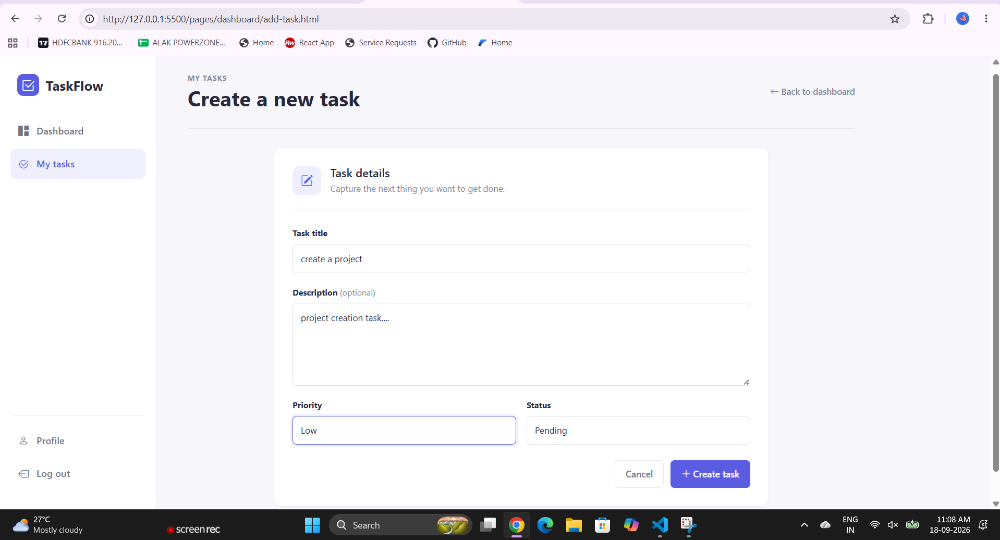
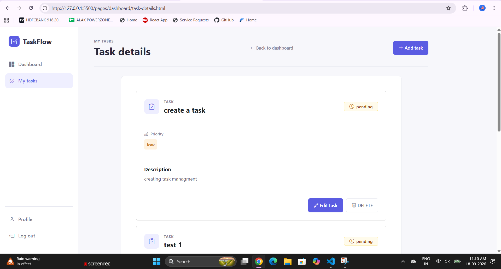

# TaskFlow — Task Management System

A clean, responsive **Task Management Web Application** built with **HTML5, CSS3, Vanilla JavaScript, Bootstrap 5, and REST APIs**.

TaskFlow helps authenticated users create, manage, update, track, and delete tasks from a simple productivity-focused dashboard.

---

## 📌 Overview

TaskFlow is a frontend-only task management application that communicates with a remote REST API.

It demonstrates practical frontend development concepts including:

- User registration and login
- JWT/Bearer-token authentication
- CRUD operations
- REST API integration using `fetch()`
- Task status and priority management
- Dashboard statistics
- Chart-based data visualization
- User profile management
- Profile image validation
- Client-side form validation
- Loading states
- SweetAlert2 notifications
- Responsive UI
- Error-page handling
- Browser `localStorage` session management

---

## ✨ Features

### 🔐 Authentication

- User signup
- User login
- JWT/access-token storage
- Protected API requests
- Login-required redirects
- Logout functionality
- Session token removal

### 📝 Task Management

- Create a task
- View authenticated user's tasks
- View task details
- Edit task description
- Edit task priority
- Change task status
- Delete tasks
- Delete confirmation dialog
- Task ID validation
- Empty-task handling

### 📊 Dashboard

The dashboard provides a quick overview of the user's tasks:

- Total tasks
- Completed tasks
- Pending tasks
- In-progress tasks
- Task status doughnut chart
- Task priority bar chart

### 👤 Profile

- View user profile
- Edit profile information
- Update profile fields
- Upload profile image
- Validate image format
- Validate maximum image size

Supported profile images:

- JPG
- JPEG
- PNG

Maximum file size:

**2 MB**

### ⚠️ Error Handling

Dedicated pages are included for:

- `404` — Page Not Found
- `500` — Server/API/Unexpected Error

The application also uses `try/catch` around asynchronous API operations and provides user-friendly error feedback.

---

## 🛠️ Tech Stack

| Technology | Purpose |
|---|---|
| HTML5 | Page structure |
| CSS3 | Custom styling |
| JavaScript (ES6+) | Application logic |
| Bootstrap 5.3.8 | Responsive UI |
| Bootstrap Icons 1.11.3 | Icons |
| SweetAlert2 | Alerts and confirmations |
| Chart.js 4.4.4 | Dashboard charts |
| REST API | Backend communication |
| Fetch API | HTTP requests |
| localStorage | Access-token storage |

> **Note:** This project intentionally uses **Vanilla JavaScript** and does not require React, Vue, Angular, or another frontend framework.

---

## 🏗️ Project Architecture

```text
Task_Management_system_javascript/
│
├── css/
│   └── pages/
│       ├── 404.css
│       ├── dashboard.css
│       ├── loder.css
│       ├── login.css
│       └── signup.css
│
├── imgs/
│   ├── create_account.png
│   ├── createtask.png
│   ├── dashboard.png
│   ├── edittask.png
│   ├── login.png
│   ├── profile.png
│   ├── sucesslogin.png
│   ├── sucess_creating_account.png
│   ├── task-details-1.png
│   └── taskdetails.png
│
├── js/
│   ├── auth/
│   │   ├── login.js
│   │   ├── logout.js
│   │   └── signup.js
│   │
│   ├── dashboard/
│   │   ├── add-task.js
│   │   ├── dashboard.js
│   │   ├── edit-task.js
│   │   └── task-details.js
│   │
│   ├── profile/
│   │   ├── edit-profile.js
│   │   └── profile.js
│   │
│   ├── loader.js
│   └── sidebar.js
│
├── pages/
│   ├── auth/
│   │   ├── login.html
│   │   └── signup.html
│   │
│   ├── dashboard/
│   │   ├── add-task.html
│   │   ├── dashboard.html
│   │   ├── edit-task.html
│   │   └── task-details.html
│   │
│   ├── errors/
│   │   ├── 404.html
│   │   └── 500.html
│   │
│   └── profile/
│       ├── edit-profile.html
│       └── profile.html
│
├── documentation.txt
└── index.html
```

---

## 🔄 Application Flow

```text
Landing Page
     │
     ▼
  Sign Up ──────────────┐
     │                  │
     ▼                  │
  Login ◄───────────────┘
     │
     │ Access Token
     ▼
 Dashboard
     │
     ├── My Tasks
     │     ├── View
     │     ├── Add
     │     ├── Edit
     │     ├── Change Status
     │     └── Delete
     │
     ├── Profile
     │     └── Edit Profile
     │
     └── Logout
```

---

## 🔑 Authentication

TaskFlow uses an access token returned by the authentication API.

After successful login, the token is stored in:

```javascript
localStorage.setItem("accessToken", result.accessToken);
```

Protected requests send the token through the `Authorization` header:

```http
Authorization: Bearer <accessToken>
```

Logout clears the session token:

```javascript
localStorage.removeItem("accessToken");
```

### Authentication Endpoints

```http
POST /api/auth/signup
POST /api/auth/login
```

---

## 🌐 API Integration

### API Base URL

```text
https://intern-crud-task-api.onrender.com
```

### Task Endpoints

#### Get Tasks

```http
GET /api/tasks
```

#### Create Task

```http
POST /api/tasks
```

#### Update Task Details

```http
PATCH /api/tasks/{id}
```

The frontend currently updates:

- Description
- Priority

The task title is treated as immutable by the frontend.

#### Update Task Status

```http
PATCH /api/tasks/{id}/status
```

Common UI status values:

```text
pending
in-progress
completed
```

The dashboard also normalizes backend status variations such as:

```text
pending
in_progress
in-progress
complete
completed
done
```

#### Delete Task

```http
DELETE /api/tasks/{id}
```

---

## 👤 Profile API

### Get Profile

```http
GET /api/profile
```

### Update Profile

```http
PATCH /api/profile
```

Profile updates use `FormData` so text fields and an optional image can be submitted together.

---

## 📈 Dashboard Logic

The dashboard does not depend on a separate statistics endpoint.

Instead, it requests the authenticated user's tasks:

```http
GET /api/tasks
```

The frontend calculates:

```text
Total Tasks
Completed Tasks
Pending Tasks
In Progress Tasks
```

It also calculates priority distribution:

```text
High
Medium
Low
```

These values are displayed using Chart.js.

### Charts

- **Doughnut Chart:** task status distribution
- **Bar Chart:** task priority distribution

---

## 💻 Getting Started

### 1. Clone the repository

```bash
git clone <your-repository-url>
```

### 2. Open the project

```bash
cd Task_Management_system_javascript
```

### 3. Run the frontend

This is a static frontend project, so no `npm install` is required.

You can run it using:

- VS Code Live Server
- Any static web server
- GitHub Pages
- Another static hosting provider

### Recommended — VS Code Live Server

1. Open the project in VS Code.
2. Install the **Live Server** extension.
3. Open `index.html`.
4. Right-click the file.
5. Select **Open with Live Server**.

---

## 🚀 Usage

### Create an Account

1. Open the application.
2. Click **Get Started**.
3. Enter the required account information.
4. Submit the signup form.
5. After successful registration, continue to the application.

### Login

1. Open the Login page.
2. Enter your email and password.
3. Submit the form.
4. The access token is stored in `localStorage`.
5. You are redirected to the dashboard.

### Create a Task

1. Open **Dashboard**.
2. Click **Add Task**.
3. Enter the task information.
4. Select priority/status.
5. Submit the form.
6. The task is sent to the REST API.

### Edit a Task

Task editing uses the task ID in the URL:

```text
edit-task.html?id=<task-id>
```

The application loads the user's tasks, finds the requested task, and populates the edit form.

### Change Status

Task status is updated through the dedicated API endpoint:

```http
PATCH /api/tasks/{id}/status
```

### Delete a Task

1. Open the task list.
2. Select Delete.
3. Confirm the action in the SweetAlert2 dialog.
4. The frontend sends the delete request.
5. The task list is refreshed.

---

## 🧪 Testing Checklist

### Authentication

- [ ] Create a new account
- [ ] Login with valid credentials
- [ ] Test invalid email/password
- [ ] Test required fields
- [ ] Verify access token is stored
- [ ] Verify logout removes token
- [ ] Try accessing protected pages without login

### Tasks

- [ ] Create a task
- [ ] View tasks
- [ ] View task details
- [ ] Edit description
- [ ] Edit priority
- [ ] Change status
- [ ] Delete task
- [ ] Cancel delete confirmation
- [ ] Test invalid task ID
- [ ] Test missing task ID
- [ ] Test empty task list

### Dashboard

- [ ] Verify total task count
- [ ] Verify completed count
- [ ] Verify pending count
- [ ] Verify in-progress count
- [ ] Verify status chart
- [ ] Verify priority chart

### Profile

- [ ] View profile
- [ ] Edit profile
- [ ] Update text fields
- [ ] Upload JPG image
- [ ] Upload JPEG image
- [ ] Upload PNG image
- [ ] Reject unsupported image type
- [ ] Reject image larger than 2 MB

### Error Handling

- [ ] Test 404 page
- [ ] Test API failure
- [ ] Test network/server failure
- [ ] Verify 500 page behavior
- [ ] Verify loading states
- [ ] Verify user-friendly error messages

### Responsive UI

- [ ] Desktop
- [ ] Tablet
- [ ] Mobile
- [ ] Forms
- [ ] Sidebar/navigation
- [ ] Task cards
- [ ] Dashboard charts
- [ ] Profile page

---

## 🔒 Security Considerations

This project demonstrates frontend authentication, but client-side applications have important security limitations.

Current implementation:

- Uses Bearer access tokens for protected API requests
- Stores the access token in browser `localStorage`
- Performs client-side validation
- Restricts profile image formats and size
- Uses authenticated API requests

For a production application, consider:

- Handling expired access tokens
- Handling `401 Unauthorized` globally
- Refresh-token/session management
- Centralizing API requests
- Avoiding unsafe HTML rendering of user-controlled content
- Strong server-side validation
- Secure authentication architecture
- Appropriate token storage strategy
- CSRF/XSS protections where applicable
- Security headers and HTTPS
- Automated security testing

> Client-side validation should never replace backend validation.

---

## 🎨 UI & UX

TaskFlow follows a clean productivity-dashboard approach.

### Design goals

- Simple navigation
- Responsive layout
- Clear task information
- Consistent Bootstrap components
- User-friendly feedback
- Loading indicators
- Confirmation dialogs
- Clear error pages
- Mobile-friendly layout

---

## 📂 Important Files

| File | Responsibility |
|---|---|
| `index.html` | Application landing page |
| `js/auth/login.js` | Login API and authentication |
| `js/auth/signup.js` | Account creation |
| `js/auth/logout.js` | Logout/session clearing |
| `js/dashboard/dashboard.js` | Dashboard statistics and charts |
| `js/dashboard/add-task.js` | Task creation |
| `js/dashboard/task-details.js` | Task listing/details/delete |
| `js/dashboard/edit-task.js` | Task editing/status update |
| `js/profile/profile.js` | Profile display |
| `js/profile/edit-profile.js` | Profile update |
| `js/loader.js` | Loading-state behavior |
| `js/sidebar.js` | Sidebar interaction |
| `pages/errors/404.html` | Not-found page |
| `pages/errors/500.html` | Server-error page |

---

## ⚙️ Configuration

The API base URL is currently referenced directly in JavaScript files:

```text
https://intern-crud-task-api.onrender.com
```

For a larger or production application, it is recommended to centralize the API URL in one configuration/service file.

Example:

```javascript
const API_BASE_URL = "https://your-api-url.com";
```

Then use:

```javascript
fetch(`${API_BASE_URL}/api/tasks`);
```

This makes API changes easier to maintain.

---


## 🔮 Future Enhancements

Possible future features:

1. Task search
2. Status filtering
3. Priority filtering
4. Task sorting
5. Due dates
6. Task categories
7. Pagination
8. Empty-state screens
9. Forgot-password flow
10. Password change
11. Token refresh
12. Dark mode
13. Notifications
14. Calendar integration
15. Drag-and-drop task workflow
16. Activity history
17. Admin dashboard
18. Role-based permissions
19. Automated frontend testing
20. CI/CD pipeline

---

## 📸 Screenshots

The project includes screenshots inside the `imgs/` directory.

### Login


### Signup


### Dashboard


### Create Task



### Edit Task


### Task Details



### Profile


---

## 🌍 Deployment

Because TaskFlow is a static frontend, it can be deployed to services such as:

- GitHub Pages
- Netlify
- Vercel
- Cloudflare Pages
- Any static web server

Before deployment, verify:

- API URL is correct
- Backend API is accessible
- CORS allows the deployed frontend origin
- All relative paths work correctly
- HTTPS is enabled
- API error handling works as expected

---

## 📚 Learning Outcomes

This project demonstrates practical understanding of:

- HTML5 semantic structure
- CSS3
- Bootstrap
- Vanilla JavaScript
- DOM manipulation
- Event handling
- Form handling
- Fetch API
- Promises and `async/await`
- REST APIs
- HTTP methods
- JWT/Bearer authentication
- `localStorage`
- CRUD operations
- Dynamic rendering
- File uploads
- Client-side validation
- Error handling
- Responsive web design
- Chart.js
- UI notifications

---

## 🤝 Contributing

Contributions and improvements are welcome.

### Suggested workflow

```bash
git checkout -b feature/your-feature-name
```

Make your changes, test the application, then commit:

```bash
git add .
git commit -m "feat: add task filtering"
```

Push your branch:

```bash
git push origin feature/your-feature-name
```

Then create a Pull Request.

---

## 📝 Commit Convention

Recommended commit prefixes:

```text
feat:     New feature
fix:      Bug fix
docs:     Documentation
style:    UI/CSS formatting
refactor: Code restructuring
test:     Testing changes
chore:    Maintenance
```

Examples:

```bash
git commit -m "feat: add task status update"
git commit -m "fix: handle missing task id"
git commit -m "docs: update project README"
git commit -m "style: improve dashboard layout"
```

---

## 📄 License

This project does not currently specify a license.

If you plan to make the repository public or allow others to reuse the code, add an appropriate license file such as `MIT`, subject to your project's ownership and usage requirements.

---

## 🎥 Working Demo

Watch the TaskFlow application in action:

[](imgs\task-management-live-demo.mp4)

### Demo Flow

The demo demonstrates the complete application workflow:

```text
Signup
  ↓
Login
  ↓
Dashboard
  ↓
Create Task
  ↓
View Task
  ↓
Edit Task
  ↓
Change Task Status
  ↓
Delete Task
  ↓
Profile Management
  ↓
Logout
```

> 🎬 The demo video shows the real application running and demonstrates the main user workflows from authentication to task management.


## 👩‍💻 Developer

**Vaishnavi Bagde**

Frontend / Full Stack Developer

Built as a practical Vanilla JavaScript task-management project.

---

## ⭐ Project Summary

**TaskFlow** is a practical task-management frontend demonstrating how a framework-free JavaScript application can communicate with a REST API and provide a complete authenticated user workflow.

```text
Authentication
      ↓
Dashboard
      ↓
Task CRUD
      ↓
Status & Priority
      ↓
Profile Management
      ↓
Error Handling
      ↓
Responsive User Experience
```

If you find the project useful, consider giving the repository a ⭐ on GitHub.
# task_Management_system-

